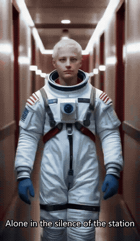

# OpenVideoStudio

**A local-first, Apache-2.0-licensed AI video creation studio.**
From one prompt to a complete video — most of it never leaves your machine.

[中文](README_CN.md) · [Install](docs/INSTALL.md) · [Roadmap](ROADMAP.md) · [Contributing](CONTRIBUTING.md)

*One thing worth knowing up front: narration currently uses one cloud
service by default (Edge TTS) — not buried, see "Local by default"
below. Everything else in the pipeline runs on your own hardware.*

### 🎬 See it work



*"Echoes of Home" — generated end-to-end from a single prompt: script →
storyboard → character/environment identity → 6 keyframes → 6 video
clips → narration → subtitles → automated edit. 2× speed above; full
32.9s video and complete provenance (prompt, models) in
[`examples/hero_demo/`](examples/hero_demo/). Not a mockup — this is the
actual pipeline, unedited. **Worth knowing:** this particular run's
character identity visibly drifts across scenes (hair/face aren't fully
consistent) — a real, disclosed instance of the gap
[Track C](docs/COMMUNITY_TRACKS.md#track-c--character-consistency) exists
to close, not something we edited around. Full account in
[`examples/hero_demo/README.md`](examples/hero_demo/README.md).*

## What it does

```
Prompt
  → Script
  → Storyboard
  → Character / Environment identity
  → Keyframes
  → AI video clips
  → Voice
  → Subtitles
  → Audio
  → Automated editing
  → Final video
```

One prompt goes in. A fully edited, narrated, subtitled video comes out.

### Local by default, with one disclosed exception

Script, storyboard, character/environment identity, keyframes, and video
clips are all generated by models running entirely on your own machine
(Ollama + ComfyUI) — none of that ever has to leave your hardware.
**Narration is the one exception today**: the default TTS provider is
Microsoft's free Edge TTS service, which sends narration text over the
network. A fully local/offline TTS provider doesn't ship yet — see
[`docs/ISSUES_SEED.md`](docs/ISSUES_SEED.md) for that as an open
contribution. We'd rather disclose this clearly than let "local" imply
more than what's actually true today.

## Why OpenVideoStudio

- **Free and open source.** Apache-2.0 licensed — no account, no
  paywall, no usage metering on the software itself. See the License
  section below for exactly what that does and doesn't cover.
- **Local-first.** See above — everything except narration's default
  provider runs entirely on your own hardware.
- **Consumer-GPU friendly.** Verified end-to-end on a 6GB laptop GPU (see
  [`docs/HARDWARE.md`](docs/HARDWARE.md) for exactly what's tested vs.
  expected vs. unknown — we don't claim hardware support we haven't
  verified; NVENC-capable NVIDIA GPUs only for now, no CPU/other-vendor
  encode fallback yet).
- **Provider selection is a config change, not a code change.** Every
  model category (LLM, image, video, TTS) is defined as an interface in
  `providers/base.py`; which concrete provider runs is read from
  `config.toml`, not hardcoded in the pipeline. Adding a new provider is
  one new file implementing the relevant interface, plus a two-line
  registration (an import and a registry entry) in `providers/registry.py`
  — see
  [`docs/COMMUNITY_TRACKS.md`](docs/COMMUNITY_TRACKS.md)'s Model Gateway
  track. An OpenAI-compatible adapter doesn't ship yet (tracked as a
  seeded issue) — today's shipped providers are Ollama, ComfyUI
  (SDXL + LTX-Video), and Edge TTS.
- **Resumable, with a human review gate.** Generation is checkpointed
  stage by stage; nothing renders past the storyboard until you approve
  it, and a failed run resumes instead of restarting from scratch.
- **Automated video QC.** Freeze/motion detection, schema validation, and
  narrative-quality checks run automatically during generation.

Two modes, one honest label for each:
- **Quick Mode** (shipping today): prompt → automatic generation up to a
  mandatory storyboard review checkpoint → (you approve) → automatic
  generation → final video. It's not zero-touch end-to-end by design —
  the review gate is a deliberate safety feature, not a missing one.
- **Pro Mode** (roadmap, not yet built): a guided UI over character
  design, environment design, and keyframe review as their own steps,
  plus a real timeline editor. See [`ROADMAP.md`](ROADMAP.md) — anything
  not shipping today is labeled ROADMAP, HELP WANTED, or RESEARCH, never
  presented as done.

## Try it

```bash
git clone <repository-url>
cd OpenVideoStudio/studio
pip install -r requirements.txt
cp .env.example .env    # set COMFYUI_ROOT
python app.py
```

Full setup (models, Ollama, ComfyUI, ffmpeg, troubleshooting) in
[`docs/INSTALL.md`](docs/INSTALL.md) — targeting under 10 minutes once
you already have the required models downloaded.

Also included: **Media Remix**, a secondary tool in the same app for
turning your own personal photo/video library into an edited montage —
built on the same shared FFmpeg/audio/scoring core as the AI Creation
pipeline.

## Why I built this

I didn't start OpenVideoStudio with access to expensive GPUs or a large
AI budget — the opposite. My main machine is a laptop with an RTX 3060
6GB GPU (see [`docs/HARDWARE.md`](docs/HARDWARE.md) for exactly what's
verified on it, not just claimed). Paying per-generation credits just to
experiment wasn't something I could keep doing indefinitely, and the
hardware itself isn't particularly powerful either. So instead of
solving the problem with more compute, I built the workflow: prompt →
script → storyboard → keyframes → clips → narration → subtitles →
assembled video, made to actually run end-to-end on the machine I
already had.

It's still far from finished. Character identity drifts across scenes
more than I'd like — see the hero demo's own disclosure above and
[Track C](docs/COMMUNITY_TRACKS.md#track-c--character-consistency), the
open track that exists specifically to fix this. More providers need
integrating, the editor is still spec-only, and Linux/macOS support
isn't there yet. Rather than keep building all of that alone behind a
closed door, I'd rather open it now — to developers, creators, and
researchers, especially anyone else working without unlimited GPUs or
API budgets. Found a bug? Open an issue. Have an idea? Start a
Discussion. Can fix even one small thing? Send a PR — see
[`CONTRIBUTING.md`](CONTRIBUTING.md). I'd like the Contributors page to
eventually have more than one name on it.

## Want to help build OpenVideoStudio?

The core pipeline is maintainer-led and tested. Everything past that is a
real, independently claimable contribution track — we deliberately didn't
build all of it ourselves so there'd be something worth contributing to.

| Track | What it covers |
|---|---|
| 🎨 [AI Art Studio](docs/COMMUNITY_TRACKS.md#track-a--ai-art--visual-development) | Character/environment bibles, reference conditioning, inpainting, Krita integration |
| 🧑 [Character Consistency](docs/COMMUNITY_TRACKS.md#track-c--character-consistency) | Visual identity drift, face-similarity QC, benchmarks |
| 🔌 [Model Gateway](docs/COMMUNITY_TRACKS.md#track-b--universal-model-gateway) | OpenAI-compatible/llama.cpp/vLLM providers, enterprise endpoints |
| 🎬 [Video Models](docs/COMMUNITY_TRACKS.md#track-d--provider-integrations) | Additional image/video model adapters |
| 🎞 [Timeline Editor](docs/COMMUNITY_TRACKS.md#track-f--timeline--editor) | Scene reorder, trimming, transitions, subtitle editor |
| 🧪 [AI Video QC](docs/COMMUNITY_TRACKS.md#track-g--ai-video-qc) | Final-video freeze QC, duplicate-shot/audio QC, quality scoring |
| 🐧 [Linux](docs/COMMUNITY_TRACKS.md#track-e--platform-support) / 🍎 [macOS](docs/COMMUNITY_TRACKS.md#track-e--platform-support) | Platform support beyond the currently-tested Windows setup |
| 🌍 [Translation](docs/COMMUNITY_TRACKS.md#track-h--documentation--localization) / 📚 [Documentation](docs/COMMUNITY_TRACKS.md#track-h--documentation--localization) | Localization, install guides, tutorials |

Start here: [`docs/ISSUES_SEED.md`](docs/ISSUES_SEED.md) has ready-to-pick
`good first issue`s with full acceptance criteria, and
[`CONTRIBUTING.md`](CONTRIBUTING.md) covers the contribution process end
to end.

## Project status

Actively developed. See [`CHANGELOG.md`](CHANGELOG.md) for what's shipped
and [`ROADMAP.md`](ROADMAP.md) for what's next. Governance model in
[`GOVERNANCE.md`](GOVERNANCE.md); security policy in
[`SECURITY.md`](SECURITY.md).

## License

[Apache License 2.0](LICENSE). See
[`docs/LICENSE_STRATEGY.md`](docs/LICENSE_STRATEGY.md) for the full
comparison against MIT/GPLv3/AGPLv3 and why Apache-2.0 was chosen — in
short, MIT-level adoption-friendliness plus an explicit patent grant,
which matters for a project this close to fast-moving AI/model tooling.
Contributors sign off commits via [DCO](https://developercertificate.org/)
(`git commit -s`) rather than a CLA — see [`CONTRIBUTING.md`](CONTRIBUTING.md).

The license covers this repository's code. It does not cover the
OpenVideoStudio name, logo, or official release channels — see
[`GOVERNANCE.md`](GOVERNANCE.md#brand-control) for how those stay
separately protected, and why a permissive code license doesn't hand
them away.
